Over the past several weeks, we have been developing **SMF Swarm 2.0** — a fundamentally different kind of multi-agent platform. While most current swarm frameworks focus on rapid prototyping or orchestration convenience, SMF Swarm 2.0 is being designed from the ground up as a **production-grade, governance-first system** capable of delivering reliable, auditable, and continuously improvable collective intelligence at scale.

This post lays out the complete vision, the research foundations, the detailed architecture, and the specific ways this platform can transform high-stakes professional verticals.

## The Problem with Current Multi-Agent Systems

Most existing agent swarm platforms suffer from the same structural weaknesses:

- Governance and security are afterthoughts
- Capability gaps are invisible until they cause failures
- Verification is limited to final task outcomes
- Scaling behavior is poorly understood
- There is no principled way to revoke compromised agents

These limitations make current systems unsuitable for regulated industries, high-stakes decision making, or long-term autonomous operations.

## The SMF Swarm 2.0 Vision

SMF Swarm 2.0 is built on seven non-negotiable architectural principles:

1. **Governance First** — Cryptographic identity, revocation, and full auditability are foundational.
2. **Capability Explicitness** — Missing capabilities are automatically diagnosed and made trainable.
3. **Verification as a Primitive** — Continuous, fine-grained scoring is core to the platform.
4. **Hybrid Reasoning** — Deliberative, emergent, and hierarchical modes coexist with dynamic selection.
5. **Empirical Scaling** — Architecture decisions are informed by real scaling data.
6. **Composability** — Small, versioned modules over monolithic systems.
7. **Human Oversight by Design** — Control mechanisms are native, not bolted on.

Our north star metric is simple: **reliable, auditable, and improvable collective intelligence at production scale**.

## Research Foundations

SMF Swarm 2.0 draws directly from several high-impact papers and systems:

- **TRACE** (arXiv:2604.05336) — Capability-targeted training through contrastive diagnosis
- **LLM-as-a-Verifier** (arXiv:2607.05391) — Continuous scoring via token logit expectation
- **Society of HiveMind** (arXiv:2503.05473) — Optimizing interactions for collective intelligence
- **Towards a Science of Scaling Agent Systems** (Google Research, arXiv:2512.08296) — Empirical scaling laws
- **Heartbeat-Bound Hierarchical Credentials** (arXiv:2605.20704) — Cryptographic revocation for dynamic swarms
- **Council of High Intelligence** — Structured multi-persona deliberation with reasoning method diversity

We are not simply combining these ideas — we are synthesizing them into a cohesive, governance-first platform.

## Architecture Overview

SMF Swarm 2.0 is organized into seven layers, with **Governance & Security** as the foundational layer:

```mermaid
flowchart TB
    subgraph Layer7["7. Governance & Security Layer"]
        G1[Cryptographic Identity]
        G2[HBHC Revocation]
        G3[Permission Engine]
        G4[Immutable Audit Log]
    end

    subgraph Layer6["6. Observability & Monitoring"]
        O1[Real-time Tracing]
        O2[Capability Scoring]
        O3[Drift Detection]
        O4[Scaling Analytics]
    end

    subgraph Layer5["5. Orchestration & Topology Engine"]
        T1[Topology Router]
        T2[Hierarchical Mode]
        T3[Deliberative Mode]
        T4[Emergent/Mesh Mode]
        T5[Hybrid Mode]
    end

    subgraph Layer4["4. Capability & Verification Layer"]
        C1[Capability Diagnostic Engine]
        C2[LLM-as-a-Verifier]
        C3[Synthetic Environment Generator]
    end

    subgraph Layer3["3. Agent Runtime & Specialization"]
        A1[Specialized Personas]
        A2[Council of High Intelligence]
        A3[LoRA / Adapter Management]
    end

    subgraph Layer2["2. Communication & Coordination"]
        Comm1[Hermes Agent Chat Service]
        Comm2[Structured Messaging A2A/MCP]
        Comm3[Kanban Task Handoff]
    end

    subgraph Layer1["1. Memory & Knowledge Layer"]
        M1[Open Knowledge Format OKF]
        M2[Shared Memory]
        M3[Long-term Capability Memory]
        M4[Versioned Knowledge Graphs]
    end

    Layer7 --> Layer6
    Layer6 --> Layer5
    Layer5 --> Layer4
    Layer4 --> Layer3
    Layer3 --> Layer2
    Layer2 --> Layer1
```

### Layer 7: Governance & Security (The Differentiator)

This is the layer that makes SMF Swarm suitable for enterprise and regulated use.

- Cryptographic identity for every agent
- Heartbeat-Bound Hierarchical Credentials (HBHC) for fast revocation
- Central permission engine with fine-grained controls
- Immutable, cryptographically verifiable audit log

### Layer 4: Capability & Verification (The Intelligence Engine)

- **TRACE-inspired Capability Diagnostic** — Automatically identifies missing capabilities from failed trajectories
- **LLM-as-a-Verifier** — Continuous scoring using token logit expectation
- Synthetic environment generation for targeted training

### Layer 5: Orchestration & Topology Engine

Instead of a fixed structure, SMF Swarm 2.0 uses a **Topology Router** that dynamically selects the best swarm structure (hierarchical, deliberative, emergent, or hybrid) based on task type and empirical scaling data.

### Layer 2: Communication & Coordination

- **Hermes Agent Chat Service** — Real-time conversational channel between agents
- Structured messaging via emerging protocols (A2A, MCP)
- Kanban for formal task handoff

---

## Key Innovations

### 1. Closed-Loop Self-Improvement

The system can now:
- Diagnose its own capability gaps
- Generate new evaluation criteria automatically
- Propose and validate targeted improvements

This moves beyond static optimization to genuine adaptive intelligence.

### 2. Hybrid Reasoning Architecture

SMF Swarm 2.0 supports multiple reasoning modes simultaneously:
- **Deliberative** (Council of High Intelligence)
- **Emergent** (HiveMind-style)
- **Hierarchical** (Orchestrator-worker)
- **Capability-targeted** (TRACE pattern)

The Topology Engine selects the optimal combination for each task.

### 3. Production-Grade Governance

Unlike most current platforms, governance is not an add-on. Cryptographic identity, revocation, permissioning, and auditing are core architectural components.

---

## Vertical Applications

### Law Offices

**Use Cases:**
- Complex legal research with multiple specialized sub-agents (case law, statutes, precedents, opposing arguments)
- Contract analysis and risk assessment with capability-specific verification
- Multi-perspective legal strategy development using deliberative Council mode

**Value Delivered:**
- Dramatic reduction in missed arguments or authorities
- Full audit trail for ethical and malpractice protection
- Consistent application of firm-specific reasoning standards

### Forensic Engineering Offices

**Use Cases:**
- Failure analysis with multiple physical, material, and procedural hypotheses
- Cross-validation of findings across different engineering disciplines
- Generation of court-admissible reports with traceable reasoning

**Value Delivered:**
- Higher confidence in conclusions through multi-agent verification
- Clear documentation of every assumption and data source
- Ability to demonstrate rigorous methodology in litigation

### Technical Consulting Firms

**Use Cases:**
- Large-scale system architecture reviews
- Technology roadmap development with multiple stakeholder perspectives
- Risk assessment across technical, operational, and strategic dimensions

**Value Delivered:**
- Reduced blind spots through capability-targeted analysis
- Consistent application of firm methodologies
- Traceable decision rationale for client reporting

### Financial Advisory & Investment Firms

**Use Cases:**
- Multi-model financial forecasting with explicit uncertainty handling
- Investment thesis development with competing hypotheses
- Regulatory compliance analysis across multiple jurisdictions

**Value Delivered:**
- Improved calibration of confidence in forecasts
- Full auditability for fiduciary responsibility
- Ability to surface and stress-test assumptions

### Political Advisory & Strategy Offices

**Use Cases:**
- Multi-stakeholder scenario planning
- Message and policy testing across different voter segments
- Opposition research with structured, auditable analysis

**Value Delivered:**
- Reduced groupthink through structured deliberation
- Clear documentation of analytical processes
- Ability to maintain consistency across rapid response cycles

---

## Building in Public

We are developing SMF Swarm 2.0 in the open. Every major research step, design decision, and implementation milestone is documented publicly. This approach serves multiple purposes:

- Forces clarity and rigor in our own thinking
- Allows the community to follow and contribute
- Creates a body of reusable knowledge for the field
- Builds trust through transparency

All related code, documentation, and research notes are being published as we go.

---

## Current Status & Next Steps

As of July 2026, we have completed:

- Phase 1 MVP of the Hermes Agent Chat Service
- TRACE-inspired Capability Diagnostic module (integrated into SkillOpt)
- Detailed architecture specification for SMF Swarm 2.0
- Supporting artifacts (risk register, metrics catalog, comparison framework, glossary)

The next major milestone is the start of **Phase 1 implementation** of the core SMF Swarm 2.0 platform, beginning with the Governance & Capability layers.

---

*Follow @MichaelGannotti for updates on SMF Swarm and the practical infrastructure of trustworthy agent systems.*

*All research, code, and documentation referenced in this post is being published publicly as part of our commitment to building in the open.*